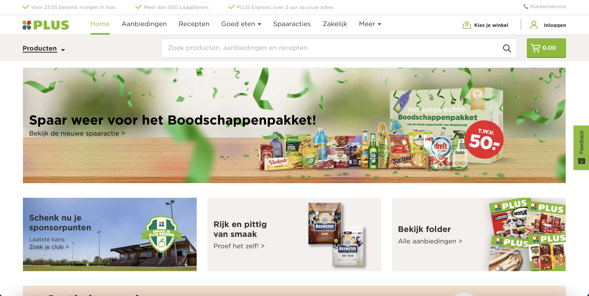
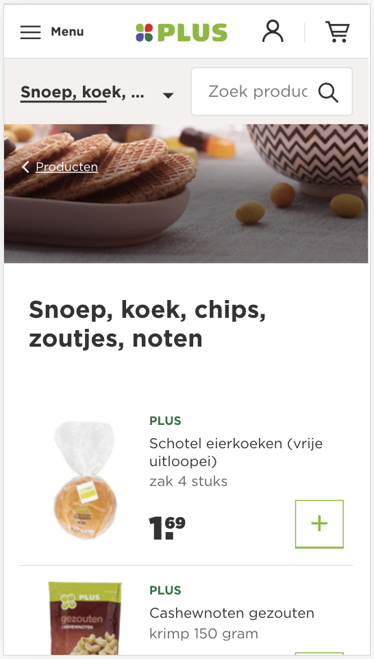
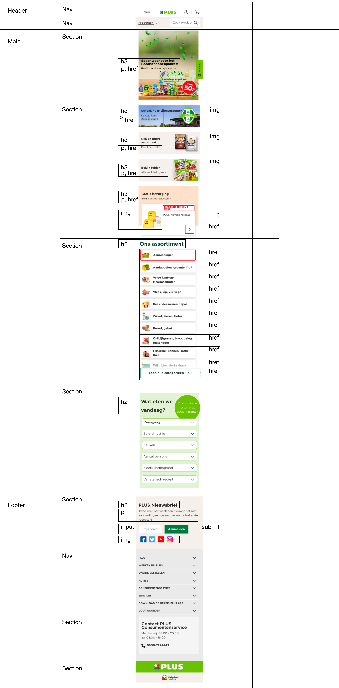
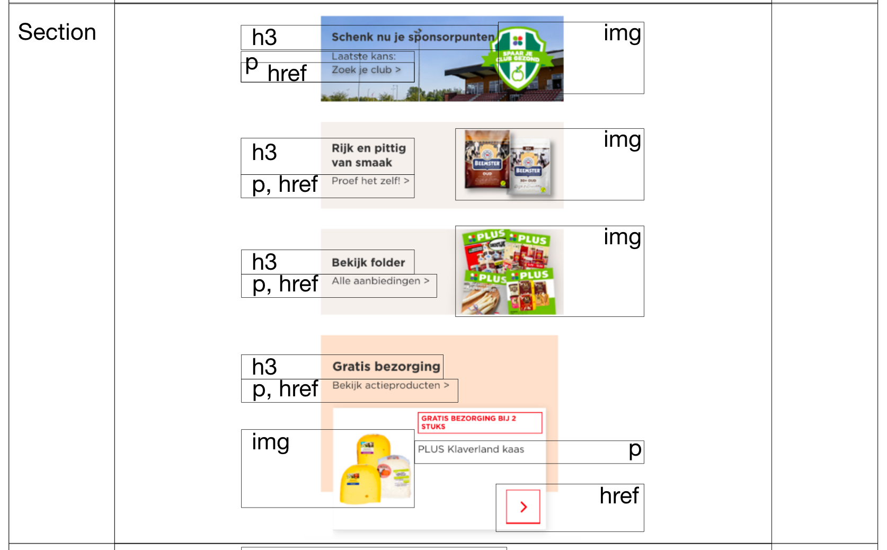
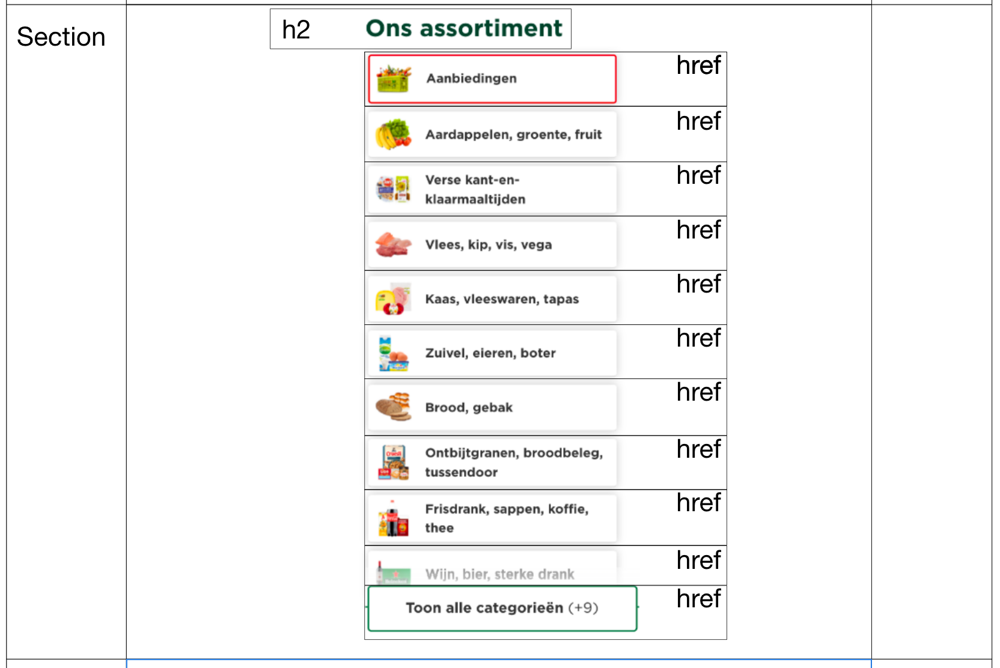
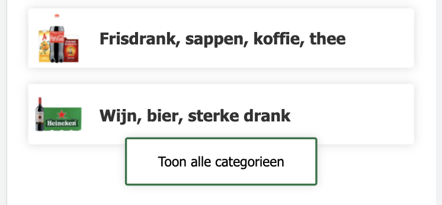
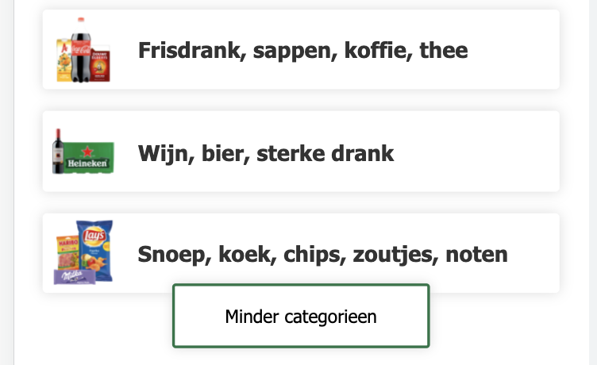

# Procesverslag
Markdown is een simpele manier om HTML te schrijven.  
Markdown cheat cheet: [Hulp bij het schrijven van Markdown](https://github.com/adam-p/markdown-here/wiki/Markdown-Cheatsheet).

Nb. De standaardstructuur en de spartaanse opmaak van de README.md zijn helemaal prima. Het gaat om de inhoud van je procesverslag. Besteedt de tijd voor pracht en praal aan je website.

Nb. Door *open* toe te voegen aan een *details* element kun je deze standaard open zetten. Fijn om dat steeds voor de relevante stuk(ken) te doen.

## Jij

### Auteur:
Lina Parren

#### Je startniveau:
Blauw

#### Je focus:
Responsive
 

## Je website

### Je opdracht:
PLUS Supermarkt: https://www.plus.nl

#### Screenshot van de eerste pagina (small screen): 
Home page

#### Screenshot van de tweede pagina (small screen):
Snoep, koek, chips, zoutjes, noten

 

## Breakdownschets (week 1)

### de hele pagina: 

### dynamisch deel (bijv menu): 

### wellicht nog een dynamisch deel (bijv filter): 

## Voortgang 1 (week 2)

### Stand van zaken
Het schrijven van de html verliep vrij vlot. Ik had er plezier aan en daardoor ging het soepel. De css werkt me nog een beetje tegen, het doet niet wat ik wil. Al met al gaat het goed, ik moet alleen nog wat dingen corrigeren. De tweede pagina moet natuurlijk ook nog gedaan worden.

### Agenda voor meeting

| Lina           
| ---            
| De 3e sectie staat niet aligned in het midden  
| Header is niet sticky        

### Verslag van meeting

- Geen gebruik van pixels, omzetten naar em
- Gebruik meteen links voor dingen die doorlinken, werk niet eerst met li

## Voortgang 2 (week 3)

### Stand van zaken
Ik ben gestart met de tweede pagina. Deze loopt echter niet helemaal lekker met de css. Verder heb ik de eerste pagina al deels responsive gemaakt. Dit gaat bij het ene onderdeel beter dan bij het andere. 

### Agenda voor meeting

| Lina           
| ---               
| hamburger menu    
| foto uitlijnen    
| > achter link     

### Verslag van meeting

- Foto aanpassen van img naar background-image
- Secties moeten breder of in het midden
- var toevoegen

## Toegankelijkheidstest (week 4)

uitwerken na test in 8e voortgang

### Bevindingen
Lijst met je bevindingen die in de test naar voren kwamen:

#### Voice-reader
Ik vond het heel apart om te zien/horen hoe een voice-reader door mijn website gaat. Ik was tevreden over hoe meerdere onderdelen voorgelezen werden en vond het ook heel handig dat de voice-reader zelf aangeeft welke toetsen je in moet duwen om een knop te gebruiken.

#### Tab 
Door middel van Tab en Shift Tab kun je door de linkjes op de website heen navigeren. Ik vond het interressant om te zien hoe dat zo werkt. Wel vond ik dat dit op nog niet genoeg onderdelen toegepast werd.

Ik kan in de website meer linkjes toevoegen om zo onderdelen te creeeren die door Tab aangehaalt worden.

#### Brillen voor slecht zicht
De brillen die ik op gehad heb, vond ik allemaal niet zo geslaagd in het simuleren van slechtziend zijn. Bij iedere bril kon je er een beetje doorheen kijken, of met dichter op het scherm gaan zitten werd het al opgelost. Er zijn echter altijd dingen die ik aan kan passen aan mijn website, om het toegankelijker te maken.

Een van de dingen die ik kan doen is mijn gehele website nalopen en checken dat de font-size overal groot genoeg is. Daarnaast kan ik erop letten dat er geen rare kleurcombinaties gebruikt worden waardoor iets wellicht niet leesbaar is.

#### Apparaat voor slechte motoriek
Het apparaat dat je laat ervaren hoe je website in gebruik is als je motoriek niet zo goed is, heb ik niet uitgeprobeerd. Dit omdat het mij doet denken aan een situatie, in mijn prive-leven buiten school, dat ik liever niet op mezelf toepas. 

Wat ik me kan inbeelden dat ik wel beter kan maken aan mijn website, is ervoor zorgen dat knoppen groot genoeg zijn. Zo heeft de gebruiker meer ruimte om erop te klikken.

## Voortgang 3 (week 4)

### Stand van zaken
Het grootste deel is af en ziet er goed uit. Enkele onderdelen die lastiger zijn wil ik er wel in, maar het lukt niet echt. Ik heb zo'n vermoeden dat ik in de laatste paar dagen voor de deadline nog goed vast ga lopen.

### Agenda voor meeting

| Lina
| ---            
| Moet het via hamburgermenu?  
| "Toon alle categorieen", hoe?
| Afbeeldingen schuiven niet helemaal goed mee            

### Verslag van meeting

- "Toon categorieen" door middel van JavaScript
- Afbeeldingen instellen als achtergrond zodat ze kloppen
- Kijk alles nog goed na of het werkt
- Kijk of er nog leuke dingen zijn om toe te voegen

## Eindgesprek (week 5)

### Stand van zaken
Goed:

Lastig:
- Door middel van JavaScript meer regels tevoorschijn laten komen (1e pagina, section(3)). Er komt namelijk maar een regel bij, terwijl het er meer zouden moeten zijn.

### Screenshot(s)

hier screenshot(s) van je eindresultaat

## Bronnenlijst

1. https://css-tricks.com/snippets/css/a-guide-to-flexbox/
    Voor het opfrissen van mijn kennis over Flexbox
2. https://reactgo.com/change-button-text-javascript/
    Voor aanpassen van de tekst in de button, door middel van JavaScript
3. https://codepen.io/shooft/pen/RwgGdvr
    Poging tot gebruik van hamburgermenu, maar dat is uiteindelijk niet gelukt.
    Tevens wel gebruikt voor het uitklappen van extra categorieen (section(3))
4. https://codepen.io/shooft/pen/eYRdEPm
    Voor uitleg over (position: ;)
5. https://codepen.io/shooft/pen/abwLwRO
    Voor uitleg over (grid: ;)
6. https://css-tricks.com/almanac/selectors/n/nth-of-type/
    Voor hoe ik alleen het laatste deel van een ul aan kan roepen
6. https://nekocalc.com/px-to-em-converter
    px omzetten naar em
7. https://www.plus.nl/ > Inspect
    Voor hoe de box-shadow eruit moest komen te zien

